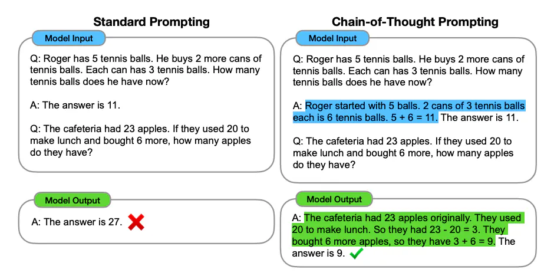

# 手把手从零教你搭建Agent框架
本项目从零开始实现了ReAct Agent的流程：
1. 任务规划
2. 工具使用
3. 简单的内存短期记忆

## 项目结构
- src
  - agent.ts Agent组件，对接结构化数据和大模型的纯文本输入输出
  - executor.ts Executor组件，负责协调各组件，运行事件循环指挥行动
  - llm.ts OpenAI API的简单封装
  - prompt.ts ReAct框架的Prompt模板
  - tool.ts Tool组件，抽象组件类
  - toolkit.ts 一些具体的Tool
- config.json：项目的一些配置
  - apiKey：openai的api key
  - model：使用的openai的模型名

## 教程