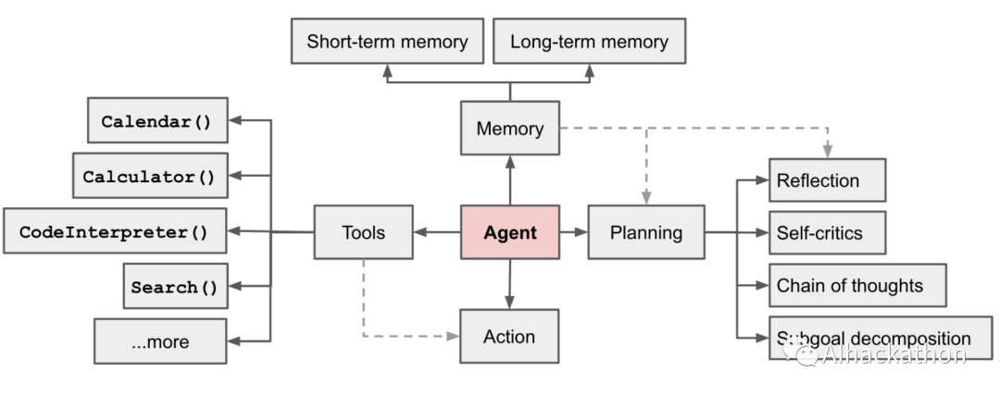
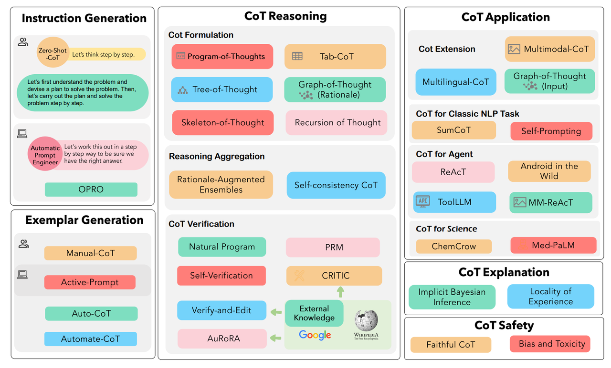
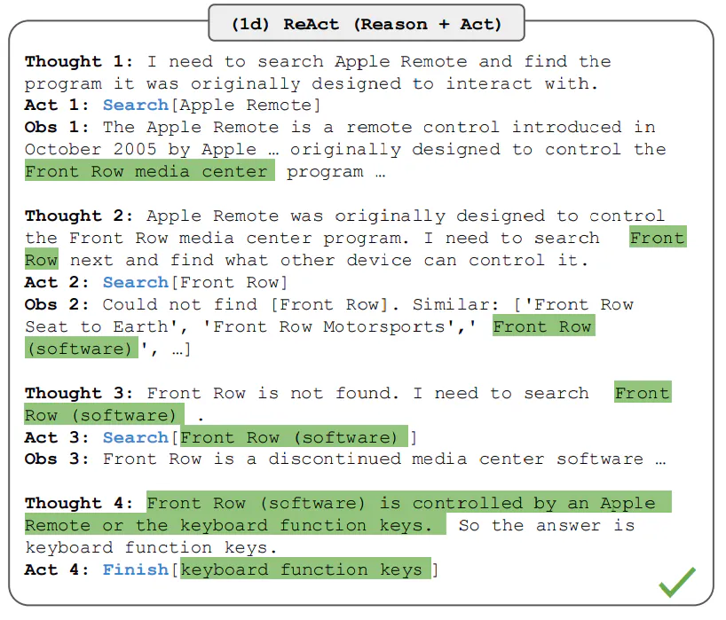
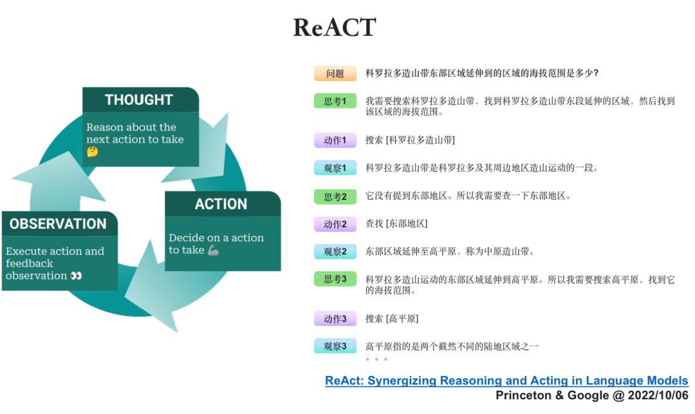
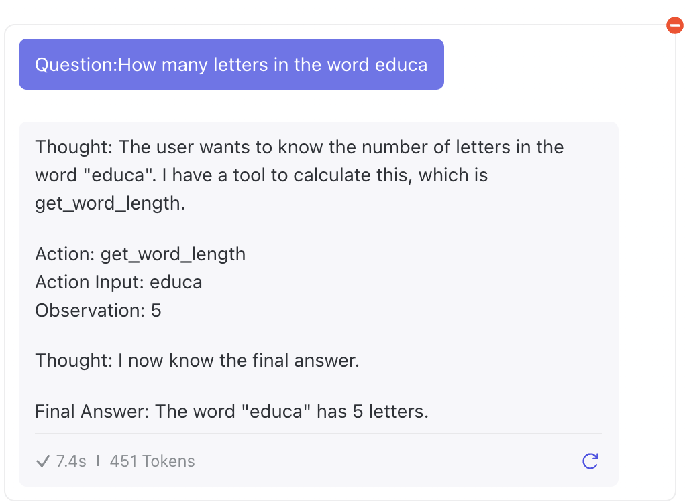
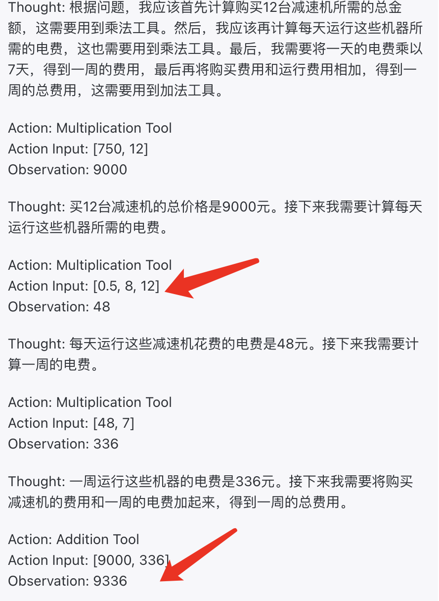
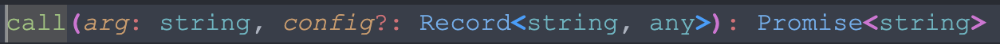
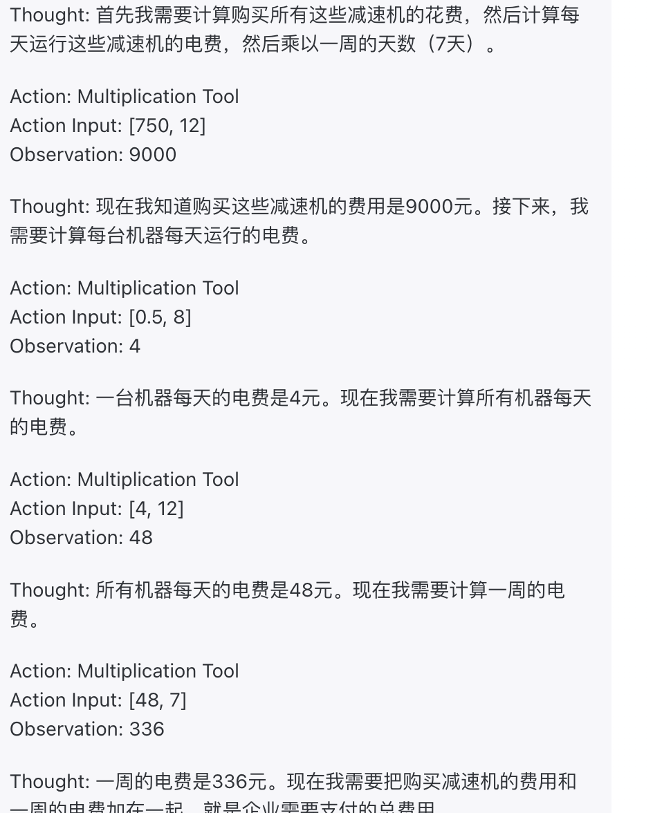
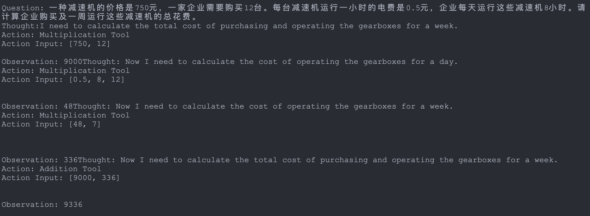

# 源码
[https://github.com/OceanPresentChao/llm-ReAct](https://github.com/OceanPresentChao/llm-ReAct)
# AI Agent
Agent的核心思想是使用语言模型来选择要采取的一系列操作。在Agent中，语言模型被用作推理引擎来确定要采取哪些操作以及按什么顺序。相比于传统机械或软件被动的“给予输入——>做出输出”的模式，Agent 由于更加强调自主的发现问题、确定目标、构想方案、选择方案、执行方案、检查更新的特性，因此可以被认为是一类拥有“自主智能的实体”，而被广泛称之为智能体。
⚠️下文介绍的Plan/Memory/Tool三组件只是Agent框架一种简单的拆分（参考了LangChain），除此外还有多种理解Agent框架的视角，读者若感兴趣可以自行学习以下Agent框架

- Baby AGI
- [Auto GPT](https://github.com/Significant-Gravitas/AutoGPT)
- [Agents框架](https://github.com/aiwaves-cn/agents)
- 清华大学的XAgent


## **Planning 规划**

- 子目标和分解：AI Agent 将大型任务分解为更小的、可管理的子目标，从而能够有效处理复杂的任务。
- 反思和完善：Agent可以对过去的行为进行自我批评和自我反思，从错误中吸取教训，并针对未来的步骤进行完善，从而提高最终结果的质量。
## **Memory 记忆**

- 短期记忆：所有的上下文学习（参见提示工程）都是利用模型的短期记忆来学习。
- 长期记忆：这为AI Agent提供了长期保留和调用无限信息的能力，通常是通过利用外部向量存储和快速检索来实现。
## **Tool / Toolkit**
Agent学习调用外部 API 来获取模型权重中缺失的额外信息，通常这些信息在预训练后很难更改，包括当前信息、代码执行能力、对专有信息源的访问等。
工具是代理可以调用的功能，本质上就是一个函数。使用工具是AI Agent最迷人最先进的特性
# 思考框架
## CoT
语言智能可以被理解为“使用基于自然语言的概念对经验事物进行**‘理解’**以及在概念之间进行**‘推理’**的能力” 
理解能力上，作为“语言模型”的大模型具备概念理解能力并不难理解，但是仅仅像 Word2vec 一样只能得到“国王”与“男人”的“距离”更近的结论对于语言智能而言必然远远不够
真正让人惊讶的是大模型在推理上的能力涌现。推理，一般指根据几个已知的前提推导得出新的结论的过程，区别于理解，推理一般是一个“多步骤”的过程，推理的过程可以形成非常必要的“中间概念”，这些中间概念将辅助复杂问题的求解 。
2022 年，在 Google 发布的论文《Chain-of-Thought Prompting Elicits Reasoning in Large Language Models》中首次提出， **通过让大模型逐步参与将一个复杂问题分解为一步一步的子问题并依次进行求解的过程可以显著提升大模型的性能。而这一系列推理的中间步骤就被称为思维链（Chain of Thought） **。

CoT大家应该都比较熟了，使用它的方法很简单：
对于Zero-Shot，只需要在Prompt的结尾加一句：
```
Let's think step by step
```
对于One-Shot或Few-Shot，需要在Prompt中适当地为大模型提供一些示例
拓展：CoT其实也在逐渐进化，出现了各种让大模型进行复杂链路思考的方式

## ReAct
无论是环境的反馈，还是人类的指令，Agent 都需要完成一个对接收到的信息进行“理解”，并依据得到的理解进行意图识别，转化为下一步任务的过程 。在前文中之所以介绍CoT，是因为使用 CoT 可以大大帮助模型对现有输入进行“感知”，激活大模型对任务的拆分规划和推理能力。借鉴CoT，我们可以归纳出基本的Agent框架并延伸，ReAct就是其中之一
从 [Yao等人，2022(opens in a new tab)](https://arxiv.org/abs/2210.03629) 引入了一个框架，其中 LLMs 以交错的方式生成 _推理轨迹_ 和 _任务特定操作_ 。
生成推理轨迹使模型能够诱导、跟踪和更新操作计划，甚至处理异常情况。操作步骤允许与外部源（如知识库或环境）进行交互并且收集信息。
ReAct 框架允许 LLMs 与外部工具交互来获取额外信息，从而给出更可靠和实际的回应。
结果表明，ReAct 可以在语言和决策任务上的表现要高于几个最先进水准要求的的基线。ReAct 还提高了 LLMs 的人类可解释性和可信度。总的来说，作者发现了将 ReAct 和链式思考 (CoT) 结合使用的最好方法是在推理过程同时使用内部知识和获取到的外部信息。
### 运作机理
ReAct 的灵感来自于 “行为” 和 “推理” 之间的协同作用，正是这种协同作用使得人类能够学习新任务并做出决策或推理。
链式思考 (CoT) 提示显示了 LLMs 执行推理轨迹以生成涉及算术和常识推理的问题的答案的能力，以及其他任务 [(Wei等人，2022)(opens in a new tab)](https://arxiv.org/abs/2201.11903)。但它因缺乏和外部世界的接触或无法更新自己的知识，而导致事实幻觉和错误传播等问题。
ReAct 是一个将推理和行为与 LLMs 相结合通用的范例。ReAct 提示 LLMs 为任务生成口头推理轨迹和操作。这使得系统执行动态推理来创建、维护和调整操作计划，同时还支持与外部环境(例如，Wikipedia)的交互，以将额外信息合并到推理中

常用模板：
```
Answer the following questions as best you can. You have access to the following tools:

{tools}

Use the following format:

Question: the input question you must answer
Thought: you should always think about what to do
Action: the action to take, should be one of [{tool_names}]
Action Input: the input to the action
Observation: the result of the action
... (this Thought/Action/Action Input/Observation can repeat N times)
Thought: I now know the final answer
Final Answer: the final answer to the original input question

Begin!

Question: {input}
Thought:{agent_scratchpad}
```
# 搭建一个ReAct框架

## 简单的ReAct
先对各组件进行硬编码。我们为大模型提供一个get_word_length工具（Tool），使用ReAct框架看看他能否解决一些基本问题
System Prompt：
```
Answer the following questions as best you can. You have access to the following tools:

get_word_length(word: str) -> int:
    """Returns the length of a word."""

Use the following format:

Question: the input question you must answer
Thought: you should always think about what to do
Action: the action to take, should be one of [get_word_length]
Action Input: the input to the action
Observation: the result of the action
... (this Thought/Action/Action Input/Observation can repeat N times)
Thought: I now know the final answer
Final Answer: the final answer to the original input question

Begin!
```
User Input：
```
Question:How many letters in the word educa
```
⚠️注意！这里只是简单在用大模型调试prompt，get_word_length工具并没有具体的代码实现也没有运行。之所以能算出结果都是靠大模型自身的推理能力！

# Agent
Agent相当于整体框架的思维推理系统，通常由大模型、Prompt提供支持。不同的智能体有不同的推理提示风格、不同的输入方式以及不同的解析输出方式，依赖于用户对应用的自定义，说白了就是对大模型进行一层封装更方便管理
这里提到的Agent其实就是大模型本身，我们在框架中最好将大模型的API进行面向对封装，方便与框架中其他组件交互
这里我使用的是OpenAI 的GPT-3.5-turbo模型
```
class LLMSingleActionAgent {
  llm: AzureLLM
  tools: StructuredTool[]
  stop: string[]
  private _prompt: string = '{input}'
  constructor({ llm, tools = [], stop = [] }: LLMSingleActionAgentParams) {
    this.llm = llm
    this.tools = tools
    if (stop.length > 4)
      throw new Error('up to 4 stop sequences')
    this.stop = stop
  }
 }
```
### Agent Inputs 代理输入
对大模型的输入可以是普通的Prompt字符串；也可以是键值对，结合Prompt Template拼接出最终的Prompt字符串
### Agent Outputs 代理输出
输出是要执行的下一个操作或要发送给用户的最终响应（ AgentAction 或 AgentFinish ）
对大模型的输入可以是普通的Prompt字符串；也可以是键值对，结合Prompt Template拼接出最终的Prompt字符串。我们这里使用ReAct框架，每次输入的Prompt都有固定的模板Template（见上文ReAct的模板）。因此需要一个填充模板的函数，我们简单约定变量按`{var}`的格式插入，用正则表达式将字符串替换
```
function fillPromptTemplate(promptTemplate: string, inputs: promptInputs) {
  let res = promptTemplate

  for (const [key, val] of Object.entries(inputs))
    res = res.replaceAll(new RegExp(`{\\s*${key}\\s*}`, 'g'), val)

  return res
}
```
# Action
### AgentAction 代理行动
这是一个数据类，表示代理应采取的操作。它有一个 tool 属性（这是应该调用的工具的名称）和一个 tool_input 属性（该工具的输入）
### AgentFinish 代理完成
这表示代理准备好返回给用户时的最终结果。它包含一个 return_values 键值映射，其中包含最终的代理输出。通常，这包含 output 键，其中包含代理响应的字符串。
### Intermediate Steps 中间步骤
这些代表先前的代理操作以及当前代理运行的相应输出。这些对于传递到未来的迭代非常重要，因此代理知道它已经完成了哪些工作。其类型为 List[Tuple[AgentAction, Any]] 。请注意，观察目前保留为 Any 类型，以实现最大程度的灵活性。实际上，这通常是一个字符串。
# Tool
## 在Prompt中描述工具
```
export abstract class StructuredTool {
  name: string
  description: string
  constructor(name: string, description: string) {
    this.name = name
    this.description = description
  }

  abstract call(arg: string, config?: Record<string, any>): Promise<string>

  getSchema(): string {
    return `${this.declaration} | ${this.name} | ${this.description}`
  }

  abstract get declaration(): string
}
```
工具类有name和description两个属性，通过getSchema函数返回对该工具的文本描述。这里我们先简单地将两个描述信息拼接一下，为Agent提供4个算数工具
⚠️注意！这里只是简单在用大模型调试prompt，这几个工具并没有具体的代码实现也没有运行。之所以能算出结果都是靠大模型自身的推理能力！（简单的加减乘除即使没有外部工具他也能做到）
```
1. Addition Tool: A tool for adding two numbers
2. Subtraction Tool: A tool for subtracting two numbers
3. Division Tool: A tool for dividing two numbers
4. Multiplication Tool: A tool for multiplying two numbers
```
简单地运行一个应用算术题：

尽管Agent经过多步思考成功解决了这个问题，但有个小bug，在第二步中，Agent调用乘法工具传入了3个参数。如果我们实现工具的时候函数只接受两个参数这里就会报错。
出现这个问题是因为我们提供的工具描述还不够准确，不仅要提供工具的名字和功能描述，最好的就是将函数的声明也带上。因为我们的函数代码本身是硬编码的，要尽一切可能降低大模型输出的随机性，严格按我们的要求输出
## 为工具函数生成函数声明
### 方案一：手动Copy
一个笨办法就是直接copy自己写的函数声明，硬编码到工具的description中。
按两下cv键还是很快的。缺点就是1. 不够灵活，修改函数声明时需要把硬编码的字符串也更改 2. 万一写的是宽松类型的代码（js、python），还得自己想函数声明
例如对于call函数，直接把这个复制下来放到description中就行了

### 方案二：AI自动生成
根据“大模型不收敛”定理——当你想为大模型做一件事时，先想想这件事本身是不是也能让大模型做。我们也可以让大模型为工具函数生成函数声明
使用下面的prompt：
```
请为下面的{language}代码生成函数声明：
{code}
```
同理也可以帮助生成函数功能描述
```
请用一两句话描述下面{language}代码的功能：
{code}
```
该方案的优缺点和方案一相同。主要针对宽松类型的代码，省了点脑子
### 方案三：zod自动生成
Zod 是一个以 TypeScript 为首的模式声明和验证库 ，弥补了 TypeScript 无法在运行时进行校验的问题
依靠zod的一些插件，我们可以直接将zod定义的类型对象转换成类型声明字符串
例如：

- [zod-to-ts](https://github.com/sachinraja/zod-to-ts): Generate TypeScript definitions from Zod schemas.
- [zod-to-json-schema](https://github.com/StefanTerdell/zod-to-json-schema): Convert your Zod schemas into [JSON Schemas](https://json-schema.org/).
- [zod-to-openapi](https://github.com/asteasolutions/zod-to-openapi): Generate full OpenAPI (Swagger) docs from Zod, including schemas, endpoints & parameters.

根据自己应用联调的需求选择即可
优点就是非常灵活，且支持运行时。唯一的缺点就是要学习zod的用法

将函数声明加入Prompt后，可以看到Agent学会了多次进行乘法，符合我们的函数声明
⚠️如果大模型实在是笨的学不会传入正确数量的参数，那就只能将我们的工具函数修改为兼容动态参数的形式了。
# Executor
代理执行器executor是Agent的运行时，可以理解为AI Agent的大脑，他协调各个组件并指导操作。这实际上是调用代理，执行它选择的操作，将操作输出传递回代理，然后重复
```
class AgentExecutor {
  agent: LLMSingleActionAgent
  tools: StructuredTool[] = []
  maxIterations: number = 15

  constructor(agent: LLMSingleActionAgent) {
    this.agent = agent
  }
  
  addTool(tools: StructuredTool | StructuredTool[]) {
    const _tools = Array.isArray(tools) ? tools : [tools]
    this.tools.push(..._tools)
  }
}
```
最关键的就是executor的执行循环了，executor会始终进行如下事件循环直到 目标被解决了 或者 思考迭代次数超过了最大次数：

1. 根据之前已经完成的所有步骤（一个步骤包括 ReAct框架中的 Thought、Action、Observation）和 目标（用户的问题）规划出接下来的Action（使用什么工具 以及 工具的输入）
2. 检测是否已经达成目标，即Action是不是ActionFinish。是的话就返回结果，不是的话说明还有行动要完成
3. 根据Action，执行具体的工具，等待工具返回结果。工具返回的结果就是这一轮步骤的Observation
4. 保存当前步骤到记忆上下文，如此反复
```
async call(input: promptInputs): Promise<AgentFinish> {
    const toolsByName = Object.fromEntries(
      this.tools.map(t => [t.name, t]),
    )

    const steps: AgentStep[] = []
    let iterations = 0

    while (this.shouldContinue(iterations)) {
      const output = await this.agent.plan(steps, input)
      console.log(iterations, output)

      // Check if the agent has finished
      if ('returnValues' in output)
        return output

      const actions = Array.isArray(output)
        ? output as AgentAction[]
        : [output as AgentAction]

      const newSteps = await Promise.all(
        actions.map(async (action) => {
          const tool = toolsByName[action.tool]

          if (!tool)
            throw new Error(`${action.tool} is not a valid tool, try another one.`)

          const observation = await tool.call(action.toolInput)

          return { action, observation: observation ?? '' }
        }),
      )

      steps.push(...newSteps)

      iterations++
    }

    return {
      returnValues: { output: 'Agent stopped due to max iterations.' },
      log: '',
    }
  }
```
# 运行
这里我们为大模型提供了加减乘除四个工具（按理来说这四个工具不需要实际的函数大模型也可以执行hhhh，但本质上是不一样的）我们可以看到大模型最后成功迭代出了计算结果为9336元
```
describe('agent', () => {
  const llm = new AzureLLM({
    apiKey: Config.apiKey,
    model: Config.model,
  })
  const agent = new LLMSingleActionAgent({ llm })
  agent.setPrompt(REACT_PROMPT)
  agent.addStop(agent.observationPrefix)
  agent.addTool([new AdditionTool(), new SubtractionTool(), new DivisionTool(), new MultiplicationTool()])

  const executor = new AgentExecutor(agent)
  executor.addTool([new AdditionTool(), new SubtractionTool(), new DivisionTool(), new MultiplicationTool()])
  it('test', async () => {
    const res = await executor.call({ input: '一种减速机的价格是750元，一家企业需要购买12台。每台减速机运行一小时的电费是0.5元，企业每天运行这些减速机8小时。请计算企业购买及一周运行这些减速机的总花费。' })
    expect(res).toMatchInlineSnapshot(`
      {
        "log": "Final Answer: The total cost of purchasing and operating the gearboxes for a week is 9336 yuan.",
        "returnValues": {
          "output": "The total cost of purchasing and operating the gearboxes for a week is 9336 yuan.",
        },
      }
    `)
  }, { timeout: 50000 })
})
```

# 可改进的地方

1. 处理代理选择不存在的工具的情况
2. 加入更复杂的记忆Memory系统
3. 多个Agent合作
4. 更复杂的工具，在一个Action中调用多个工具
5. 处理工具错误的情况
6. 处理代理生成无法解析为工具调用的输出的情况
7. 所有级别（代理决策、工具调用）的日志记录和可观察性到标准输出
